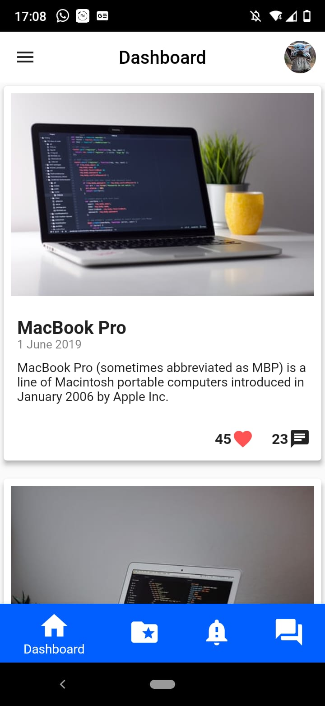
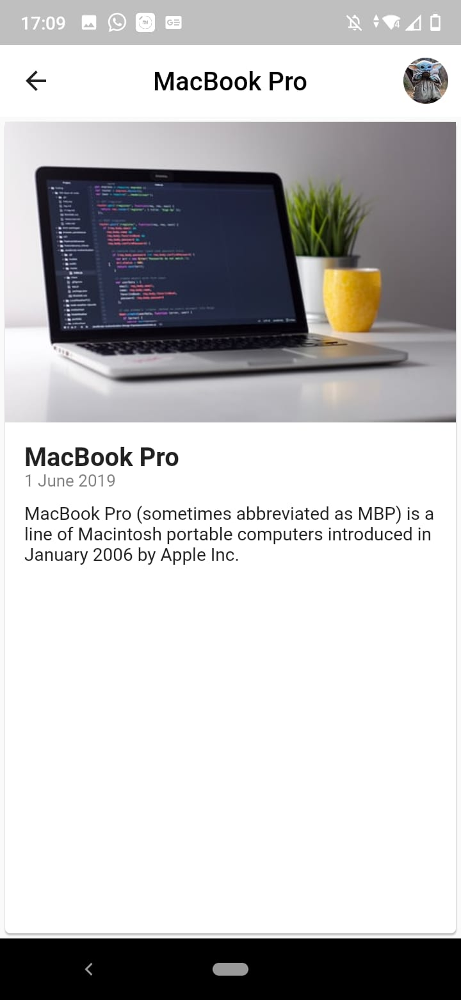
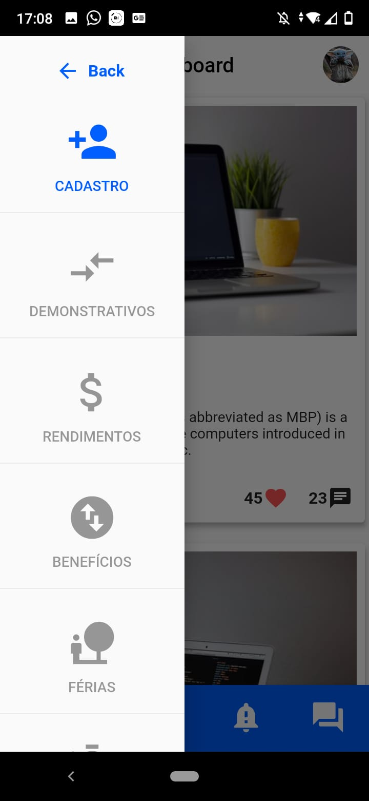
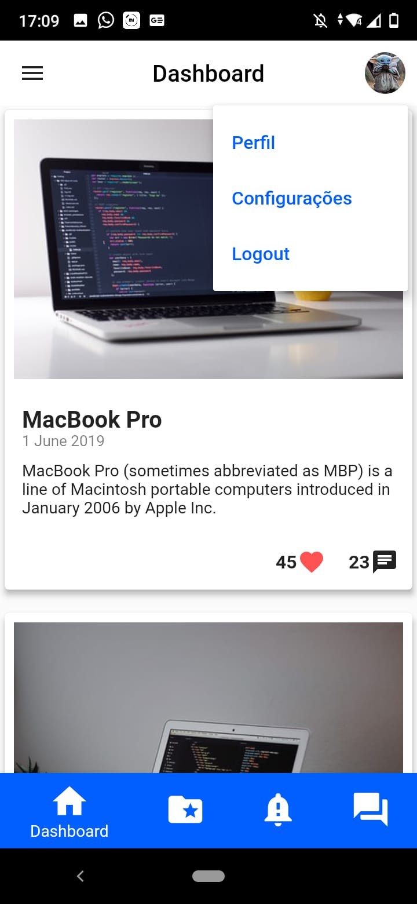
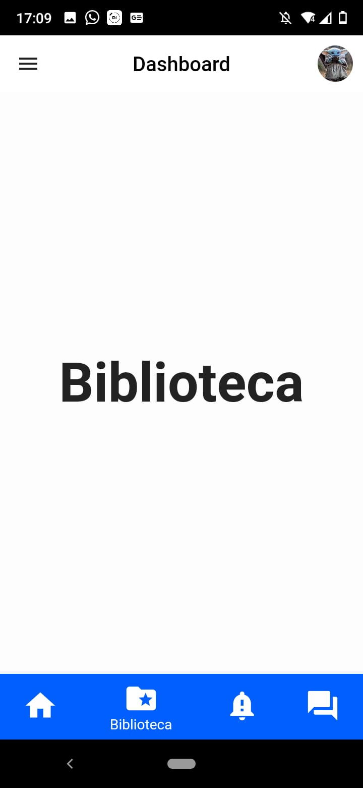
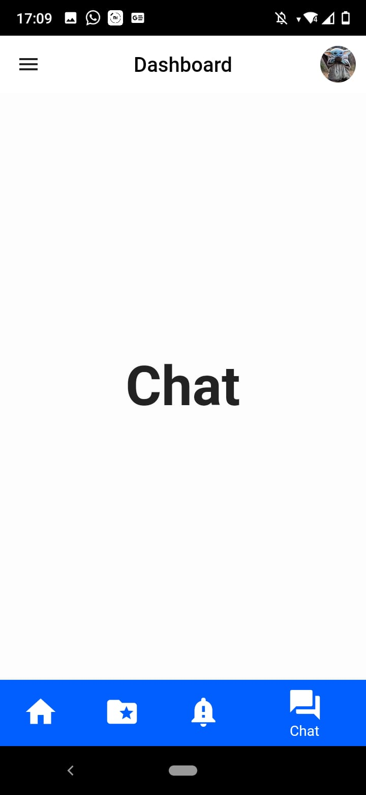

# WHR MALLTEC

Aplicativo de gestão de setores.

## Baixar APK
<a href="screenshots/app.apk" download="whr-malltec.apk"title="Demonstração do aplicativo" alt="Demonstração do aplicativo">Baixar APK</a>

## Vídeo Apresentação

<video width="320" height="240" controls>
  <source src="screenshots/video-apresentacao.mp4" type="video/mp4">
  <source src="movie.ogg" type="video/ogg">
    Seu browser não tem suporte para tag vídeo.
</video>

## Screenshots
            
             

## Mais sobre o framework FLUTTER

[Documentação](https://flutter.io/).
